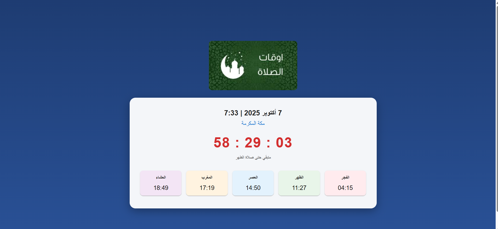

# تطبيق مواقيت الصلاة




تطبيق ويب لعرض مواقيت الصلاة مع عداد تنازلي للصلاة القادمة.

## المميزات

- عرض مواقيت الصلاة الخمس
- عداد تنازلي للصلاة القادمة
- واجهة مستخدم جميلة وسهلة الاستخدام
- تصميم متجاوب يعمل على جميع أحجام الشاشات
- تحديث تلقائي للوقت والمواقيت

## التقنيات المستخدمة

- React.js
- Vite
- Material-UI
- React Icons

## كيفية التشغيل

1. قم بتثبيت المتطلبات:
```bash
npm install
```

2. قم بتشغيل التطبيق:
```bash
npm run dev
```

3. افتح المتصفح على الرابط:
```
http://localhost:5173
```

## بناء التطبيق للإنتاج

```bash
npm run build
```


## الترخيص

هذا المشروع مرخص تحت [MIT License](LICENSE).
